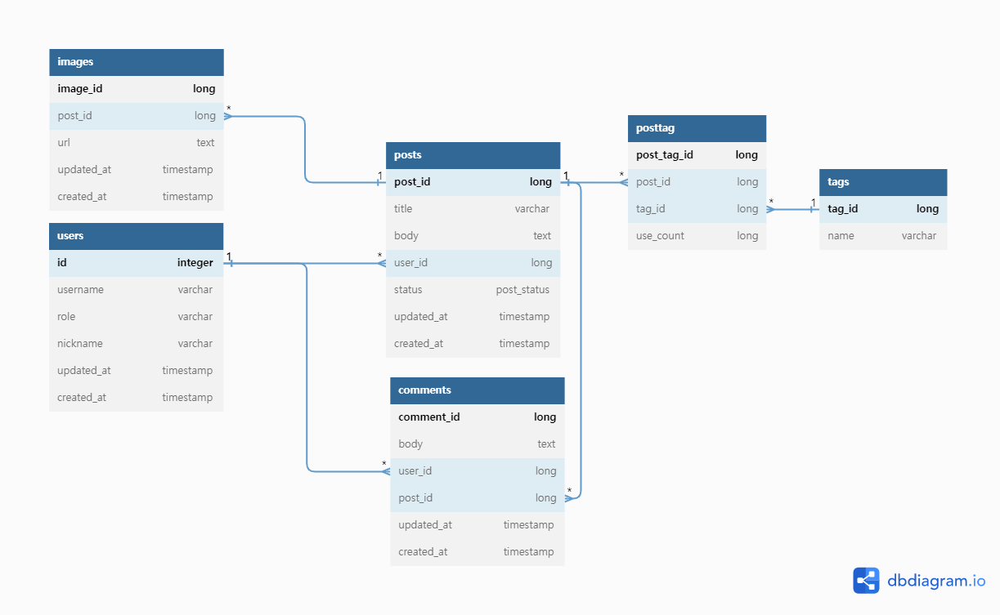

# 복습용 프로젝트 - 블로그 

## 요구사항
1. 글 작성 및 수정
- 제목, 내용, 이미지, 태그 등의 정보를 포함한 글 작성 기능
- 글 작성 시 마크다운 문법을 사용할 수 있도록 지원
- 작성된 글은 수정 및 삭제가 가능해야 함
- 글 수정 시 기존에 작성된 내용이 수정되어야 함
2. 댓글 작성 및 수정
- 댓글을 작성하고, 수정하고, 삭제하는 기능
- 각 댓글에는 작성자의 닉네임과 댓글 내용이 표시되어야 함
3. 글 검색
- 제목, 내용, 태그 등을 기반으로 검색이 가능해야 함
- 검색 결과는 페이징 처리되어야 함
4. 태그 검색
- 태그를 클릭하면 해당 태그가 포함된 글 목록이 표시되어야 함
- 태그 검색 결과는 페이징 처리되어야 함
5. 로그인
- 회원가입 시 이메일과 비밀번호, 닉네임을 입력받아 가입을 할 수 있어야 함
- 로그인 시 이메일과 비밀번호를 입력하여 로그인할 수 있어야 함
- 로그인하지 않은 사용자는 글 작성, 댓글 작성 등의 기능을 사용할 수 없어야 함
6. 유저 관리 (선택사항)
- 회원 가입 시 이메일 중복 확인 및 비밀번호 보안 강화 기능 추가
- 로그인한 사용자의 정보를 확인할 수 있는 페이지 제공
- 회원 정보 수정, 비밀번호 변경, 회원 탈퇴 등의 기능을 제공해야 함

--- 

### 설계 

